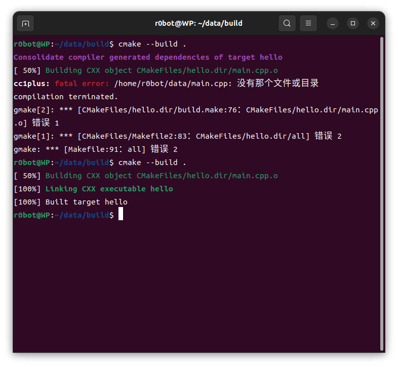
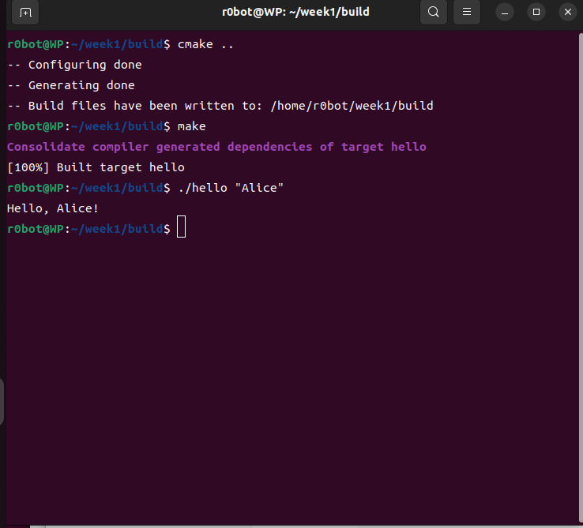
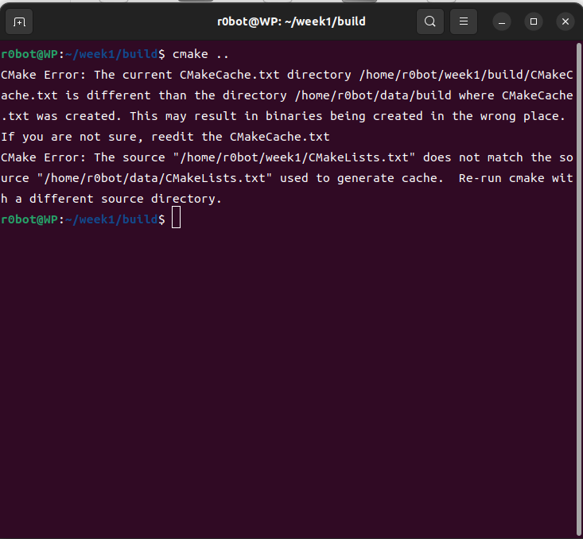

#这是一个RM视觉组新成员春季培训的公开仓库，主要用于记录、验收与考核。这个仓库会详细记录每一周期的培训内容、实践项目、所遇问题与详细解决方案。

## W1
- 本周做了什么
  1. 本周搭建了一个C++工程环境，把项目文件变成了一个本地仓库
  2. 在电脑上安装了编译器（GCC/Clang）、CMake、Git 和编辑器（VS Code）
  3. 创建了一个项目文件夹（cpp_week1），并在里面新建了 main.cpp 文件
  4. 不借助CMake，直接用编译器把源代码变成可执行程序
  5. 引入CMake构建系统，当代码很多时用3.的方法就太麻烦了，所以要用Cmake
  6. C++进度：学了函数，引用，简单类，vector/string/map，对于头文件和源文件拆分不太熟悉:
        提交的代码：
        1. 一个输入名字，输出问好的C++代码  
        2. 将原来的问候代码进行改进，改为读取命令行参数的问候代码
        3. project1代码熟悉 类，初始化列表，private和public的区别
        4. project2代码熟悉 命令行参数，引用和字符串处理
  
- 问题及解决方案：
  1. 编译时找不到文件：
        原来没有把buid建在工作空间根目录，所以找不到文件
  2. 不理解为什么不直接把工作空间（包含源码，README.md）分享给别人，非要用git：
        问AI，是因为git可以记录每一次commit的快照，随时可以查看原来的版本
  3. camke报错
        ：
        发现是由于我把工作空间的名字改为了Week1，而缓存文件在旧的data/build目录下，现在是Week1/  build，   路径不匹配,在build目录下终端输入rm -rf CMakeCache.txt CMakeFiles,把旧文件删掉就行了
  4. github注册相关问题：
        1.进不去：用stea++加速器就能进去了
        2.进去了，但是人机验证加载不出来：加速器不够用了，得用VPN，我用的clash
        3.人机验证完成了（而且做对了）但是直接弹回到注册页面：说明不是网络的问题了，仔细看注册页面的上方会有很小的英文提示你哪里不合格，英文提示很快会消失（如果不注意看你就以为没有任何提示），把英文复制下来搜什么意思，我的问题是我输入的uesername和password很相似，要我改
        4.改完问题后又加载不出来人机验证了，steam++停止加速，再重新打开重新加速
 
- 最小Cmake三行的含义:
	```cmake
	cmake_minimum_required(VERSION 3.10)
	project(Hello)
	add_executable(hello main.cpp)
	```
	第一句：设置 CMake 的最低版本要求（3.10）
	第二句：定义项目名
	第三句：告诉Cmake用main.cpp文件生成一个叫hello的可执行文件

## W2
- 本周做了什么
  1. 用鱼香ROS一键搭建ROS环境
  2. 学习ros2基本命令：
        ros2 topic list 找感兴趣的话题名。

        ros2 topic info <话题名> 看谁在发、谁在收，确认消息类型。

        ros2 topic echo <话题名> 看具体数据，判断内容是否正确。

  3. workspace / package / node / topic 分别是什么：
        1. Workspace（工作空间）
        是什么：一个文件夹（目录），用来组织和管理所有的 ROS 2 代码和编译产物。
        包含buil，install，src

        2. Package（功能包）
        是什么：ROS 2 软件组织的最小单元，也是一个文件夹，必须位于 workspace/src/ 下。
        里面包含节点、消息   定义、服务定义、配置文件等。
        示例：turtlesim 本身就是一个 package，安装后你可以在 /opt/ros/humble/share/turtlesim 里看到它
        作用：实现某个具体功能（如仿真、电机驱动、路径规划），一个 workspace 可以包含很多个 package。

        3. Node（节点）
        是什么：可执行程序（进程），是 ROS 2 系统运行的基本单元。
        示例：turtlesim_node（海龟仿真器）是一个节点，turtle_teleop_key（键盘控制）是另一个节点。
        特点：
        每个节点通常只做一件相对独立的事（单一职责）。
        节点之间通过话题、服务、动作进行通信。
        一个 package 里可以有多个节点，也可以只有一个。
        查看：ros2 node list 能列出当前运行的节点。
        4. Topic（话题）
        是什么：节点间通信的数据通道，基于发布/订阅模型。
        示例：/turtle1/cmd_vel 是一个话题，传输的消息类型是 geometry_msgs/msg/Twist。
        特点：
        节点可以向某个话题发布（publish）消息，也可以订阅（subscribe）消息。
        话题的名称（如 /turtle1/pose）是通道的标识，消息类型定义了传递数据的格式。
        发布者和订阅者互相不知道对方的存在，实现了松耦合。
        查看：ros2 topic list、ros2 topic info、ros2 topic echo。
  4. ROS基础通信流程：
        1.编写talker和listener节点
        2.修改CMakeLists.txt
        add_executable(talker src/main）生成一个可执行文件talker，后续可以直接执行
        ament_target_dependencies(talker rclcpp std_msgs)把rclcpp std_msgs的依赖附加到talker上
        3.编译
        回到工作空间根目录，colcon build --packages-select training_pkg
        4.运行测试
        两个终端分别运行talker和listener
  
  5. 关于colcon build
        1.它做了什么：进入每一个功能包，根据包内的 CMakeLists.txt（C++）或 setup.py（Python）进行配置、编译、链接。将编译结果统一输出到工作空间的 build/、install/、log/ 三个目录中
        build/ — 编译过程的中间文件。
        install/ — 最终的可执行文件、头文件、环境配置（setup.bash 等）
        log/ — 编译日志，方便排查错误
        2.在哪里执行：必须在工作空间根目录下运行

  6. source /opt/ros/humble/setup.bash
        这会加载 ROS 2 的系统级环境（ros2 命令、系统自 带的功能包，如 turtlesim、demo_nodes_cpp 等）。
     source ~/桌面/course/week2/ros2_ws/install/setup.bash
        这条命令会把编译生成的 training_pkg 等自定义包，注册到 ROS 2 的搜索路径中
       追加到~/.bashrc就可以一劳永逸了
  
  7. 为 training_pkg 补充一个 launch 文件，让 talker 的发布周期可以通过参数配置
        1.在talker.cpp中声明参数，然后用它初始化定时器，改完之后要重新编译
        2.创建launch文件
        3.安装Launch文件（修改CMakeLists.txt）
        为了让编译后ros2 launch能找到这个文件，需要在CMakeLists.txt中添加安装规则
        同时确保已经安装了ros2 launch依赖。检查packege.xml，确保有
        <exec_depend>ros2launch</exec_depend>没有就手动添加
        5.编译并测试
        先编译，再用launch文件启动 ros2 launch training_pkg talk_and_listen.launch.py
        会看到两个节点的日志同时出现在一个终端里
        6.也可以单独运行并参数
        ros2 run training_pkg talker --ros-args -p period:=0.2
        这会覆盖默认值并一0.2s周期运行
        7.总结：
        launch文件：方便批量管理节点
        参数：让行为节点可配置
        安装规则：launch文件必须安装在share下，ros2 launch才能识别
        
  8. 用 bag 录制、查看和回放自己的话题
        1.先安装 ：sudo apt install ros-humble-rosbag2 ros-humble-ros2bag
        2.录制话题
        先工作空间根目录启动talker（发布 /chatter）
        在另一个终端录制/chatter：
        cd ~/桌面/course/week2/ros2_ws录制指定话题
        ros2 bag record /chatter -o my_first_bag指定输出文件夹名
        按ctrl c停止
        3.查看bag文件信息
        ros2 bag info my_first_bag
        4.回放数据
        先停掉之前的talker，只保留listener运行
        在另一个终端回放bag:
        ros2 bag play my_first_bag
        
        
- 遇到的问题
1. ros2 topic echo 命令报错 invalid choice: 'echo/turtle1/pose'

    现象：输入 ros2 topic echo/turtle1/pose 后系统无法识别。

    原因：echo 和 /turtle1/pose 之间缺少空格，被解析为一个整体命令。

    解决：正确写法为 ros2 topic echo /turtle1/pose（子命令与话题名之间必须有空格）。

2. ros2 run training_pkg talker 提示 Package 'training_pkg' not found

    现象：编译成功后仍找不到自定义包。

    原因：忘记加载当前工作空间的环境变量。

    解决：

        在工作空间根目录执行 source install/setup.bash。

        建议将以下命令追加到 ~/.bashrc 中实现自动加载：
        bash

        echo "source ~/桌面/course/week2/ros2_ws/install/setup.bash" >> ~/.bashrc

        注意：该行应放在 source /opt/ros/humble/setup.bash 之后。
  ros2 param get /my_talker period 提示 Node not found
3. 现象：查询参数时提示节点不存在。

    原因：

        launch 文件启动的节点可能因为 launch 退出而终止。

    解决：

        保持 launch 终端运行，另开终端查询参数。


##  Week3

-本周做了什么
1. 红蓝颜色分离方法说明：
	-方法概述：
		采用 基于 HSV 颜色空间的阈值分割法，将输入图像由 BGR 转换至 HSV 空间，分别对红色和蓝色设定阈值，生成二值掩 模（red_mask、blue_mask），再通过形态学开运算去除噪声，最终得到干净的红蓝区域掩模。

	-关键参数：
	1. 颜色	HSV 阈值范围 (H, S, V) 
	H表示色相即颜色本身，S表示饱和度（灰度）即颜色纯度，V表示明度（亮度）反映光照强度与颜色本身无关
	2. 红色   H: [0, 10] ∪ [160, 180]
		S: [100, 255]
		V: [100, 255]	红色在 HSV 色相环两端，需合并两个区间

	3. 蓝色	H: [100, 130]
		S: [100, 255]
		V: [100, 255]	蓝色色相集中在中段，单一区间即可覆盖
	4. 形态学内核	MORPH_ELLIPSE, 5×5	开运算（先腐蚀后膨胀）去除小噪点并平滑边缘

	-选择理由
		1.HSV 优于 RGB
		RGB 三个通道高度相关，光照变化会导致三个分量同时改变，单纯用阈值难以稳定分离颜色。HSV 将色彩与亮度解耦，色相（H）对光照变化不敏感，能更鲁棒地描述颜色本身。

		2.红色两段式阈值
		红色在 HSV 色相环上位于 0° 附近，但 OpenCV 中 H 通道范围为 [0, 180]（0°=0, 360°=180），红色实际分布在 0° 附近和 360° 附近，即 H 的 [0, 10] 和 [160, 180]。单独一段会丢失部分红色像素，因此必须合并两者。

		3.饱和度与明度下界
		设置 S ≥ 100、V ≥ 100 是为了排除过暗（接近黑色）和过淡（接近白色）的区域，这些区域的色相信息不可靠，容易造成误检。阈值根据实际装甲板图片的照明条件调整，平衡召回率与误检率。

		4.形态学去噪
		实际场景中图像可能存在小噪声或反光斑点，开运算（先腐蚀后膨胀）能在不明显改变区域大小的前提下滤除孤立噪点，使掩模更干净，便于后续轮廓提取
		    

2. 开闭运算
        开运算后，周围小白点消失。
        闭运算后，区域内的小黑孔被填满，整体更实心。
        顺序：通常先开后闭。若目标内部噪点多，也可以交换顺序试验。
        避免过度运算：内核太大会把不同目标粘合、或把边缘模糊化，导致轮廓提取失真。可以先用较小的内核实验，逐步增大，直到满意为止。


3. 整体管线 
mask（二值） → 找轮廓 → 初筛（面积、长宽比、角度）→ 灯条候选 →
几何配对 → 装甲板四点计算 → 排序（左上、右上、右下、左下）→ 绘图 + 保存

4. 解释 inRange、形态学、轮廓、minAreaRect 的用法：
    1. cv::inRange —— 颜色过滤

作用：根据像素值范围，把图像变成一张“黑白图”（二值图）。范围内的像素变白（255），范围外的变黑（0）。
常见用途：提取特定颜色的物体（比如红色小球、蓝色障碍物）。
    2. 形态学操作 —— 去噪、填补孔洞

作用：对二值图像（通常是 inRange 产出的 mask）进行修整，消除微小噪点、连接断裂区域、闭合内部孔洞。
常用操作：

    膨胀 dilate：扩大白色区域，可以把破碎的物体连在一起。

    腐蚀 erode：缩小白色区域，可以去除孤立的小白点。

    开运算 morphologyEx(MORPH_OPEN)：先腐蚀再膨胀，用来去除噪点。

    闭运算 morphologyEx(MORPH_CLOSE)：先膨胀再腐蚀，用来填充物体内部的小黑洞。

    3. 轮廓 cv::findContours —— 提取物体边界

作用：从二值图像中，把每一块白色的连通区域的边界点全部找出来，存成点集的列表。
函数原型：

    4. cv::minAreaRect —— 最小外接旋转矩形

作用：对一个点集（比如一个轮廓），求出最小面积的包围矩形，这个矩形可以带旋转角度。它比 boundingRect（只能画水平/垂直的包围盒）更精确地贴合物体。
返回值：cv::RotatedRect，包含中心点、宽高、旋转角度。

5. 代码作用
armor_detector.h	头文件		定义 ArmorDetector 类、LightBar 结构体、ArmorResult 结构体	
armor_detector.cpp	实现		ArmorDetector 类的所有函数实现（颜色分离、形态学、灯条提取、配对、画框）	
video_processor.cpp	可执行程序	批量处理 6 个视频，调用 ArmorDetector，输出画框视频	
diagnose.cpp	        可执行程序	 打开视频第一帧，用鼠标取色，查看 HSV 值	
step5_armor.cpp  	可执行程序	对单张 armor.jpg 做完整检测（独立版，不用类）	⚠️ 旧版，已被类替代
extract_frames.cpp	抽帧工具
step4_lighitbars.cpp    原来是弄图片的，后来将流程整理成类或函数之后，就拿来测试抽帧出来的图片了
hsv_check.cpp           对图片取色
video_player.cpp        播放视频，我系统自带的视频播放器用不了
-遇到的问题：
1. 误检和漏检
Assets中误检1,2两张图（其实误检图有漏检图有无数张，这里列举两张）
        1.首先二值掩膜必须要保证红蓝装甲板的灯条是白色，我最开始就是不看掩膜乱调
        2.其次保证灯条掩膜的形状大概是矩形，因为我设置灯条结构体是矩形
        3.如果抓到斜着的灯条，角度过滤
2. 个人认为重点在于怎么把掩膜上的灯条抓住，并弄成矩形
        1.hsv_check.cpp取色，把等条大致阈值找到；
        2.然后生成的掩膜大概率是一陀覆盖了灯条的椭圆，再取色，对比灯条和周边反光区域的阈值，改变阈值范围，把灯条包含着，把周围的排除出去，这一步需要尝试很久
        3.开闭运算也可以一定程度上消除灯条周围区域
3. 关于视频
Assets中frames是对视频的抽帧，用来单独分析哪里出了问题
    1. 掩膜全黑（颜色未抓到）

    现象：视频帧的红/蓝掩膜全黑，灯条候选数为 0

    原因：视频中灯条颜色与图片 armor.jpg 不同，图片的 HSV 阈值不适用

    解决：对视频第一帧取色，重新设定视频专用阈值，在 colorSplit() 中增加 VIDEO 模式分支，视频和图片用不同阈值

    2. 蓝色掩膜 S 上限过低

    现象：Blue_1000.mp4 掩膜全黑，取色发现 S 值高达 214~255

    原因：图片模式蓝色 S 上限为 205，高饱和像素被排除

    解决：视频模式 S 上限调至 255，H 范围收窄至 [100, 115]

    3. 灯条掩膜中间断开

    现象：掩膜中灯条被分成两截，导致一个灯条被识别为两个或无法通过筛选

    原因：灯条中间有暗部或反光，闭运算核不够大，开运算太大

    解决：增大闭运算核 Size(30, 30)闭运算核 Size(1, 1)

    4. 灯条一大一小导致配对失败

    现象：运动过程中灯条忽大忽小，配对失败

    原因：canPair() 中长度比阈值 1.8 太严格

    解决：放宽长度比至 2.5，角度差至 20°

4. 自己的理解（可能不正确）：当大多数视频都能抓住灯条时，再阈值很冒险，很可能弄好的也没有了；但是改开闭运算核好像很安全
       但是开闭运算核只能解决灯条内部断开等问题，如果你的掩膜甚至没有灯条，那也只能改阈值

   


        
